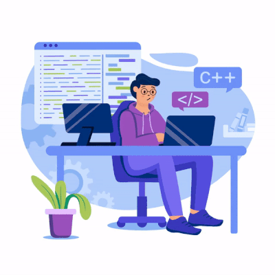

  

<h1 align="center">Hi 👋, I'm Beat_Box</h1>
<break></break>
<h3 align="center"> I'm 21 year noob dev interested to learn how to open Vscode</h3>

- 🔭 I’m currently working on **Android Dev**

- 🌱 I’m currently learning **Java**

- 📫 How to reach me **@work1.sonukumar@gmail.com**

<h3 align="left" >Connect with me:</h3>

     

<h3 align="left" >
Languages and Tools:</h3>

          

         

&nbsp;

  

