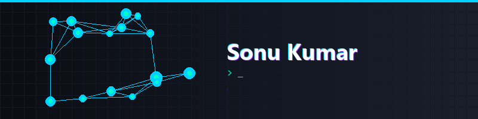

  

  <!-- Profile Views Counter -->
  

  

    
    
    
    
  

---

### 👨‍💻 About Me

I am a backend-focused **.NET Core Developer** specializing in designing, building, and maintaining high-performance backend systems, RESTful APIs, and microservices. I focus on writing **clean, maintainable, and testable code** using architectural patterns like CQRS, Clean Architecture, and Domain-Driven Design.

*   🔒 **Passion:** Developing security-oriented software, custom authentication mechanisms, and robust desktop tools.
*   🧠 **Aiding Productivity:** Actively leveraging GitHub Copilot and modern development workflows to accelerate feature delivery.
*   ⚙️ **Patterns I Live By:** Clean Architecture, Repository & Unit of Work, Dependency Injection, and CQRS with MediatR.

---

### 🚀 Highlighted Project

#### **FaceFortify 🔐**
*A cross-platform, zero-knowledge desktop folder-locking app featuring advanced facial recognition and enterprise-grade encryption.*

*   **Offline Biometrics:** Built liveness-detection and facial verification using **ONNX Runtime (ArcFace)** and **OpenCV Sharp** with 99%+ verification accuracy.
*   **Zero-Knowledge Encryption:** Implemented client-side **AES-256-CBC** file/folder encryption with hardware-bound keys derived via **PBKDF2** (100,000 iterations).
*   **Modern UI:** Developed a responsive and fluid interface using **Avalonia UI** following the MVVM pattern and ReactiveUI.
*   **OS-Level Lock:** Native system security mapping using Windows ACL and Linux `chmod` file permission management.
*   *Tech Stack:* `.NET 8`, `C#`, `Avalonia UI`, `ONNX Runtime`, `OpenCV Sharp`, `AES-256`, `PBKDF2`.

---

### 🛠 Tech Stack & Skills

  

| Category | Technologies |
| :--- | :--- |
| **Languages** |    |
| **Backend & Frameworks** |     |
| **Architecture & Testing** |    |
| **Cloud & DevOps** |    |
| **Databases** |   |

---

### 📊 GitHub Activity & Metrics

  <table border="0">
    <tr>
      <td>
        
      </td>
      <td>
        
      </td>
    </tr>
  </table>

<!-- GitHub Activity Graph -->

  

---

  
   
  <b>"Building secure, maintainable, and pragmatic systems to solve real-world problems."</b>

